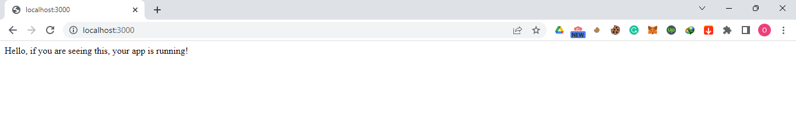
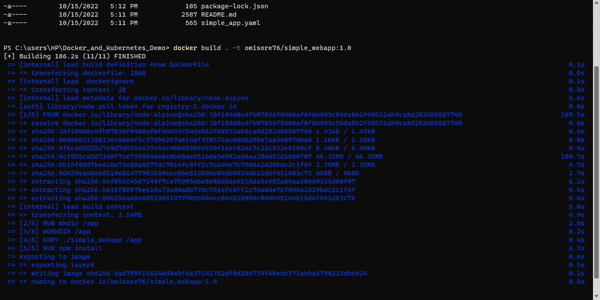
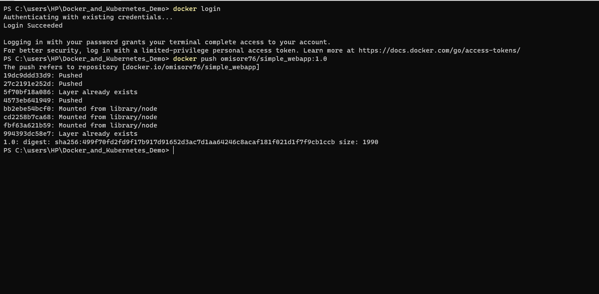

# Docker_and_Kubernetes_Demo

You will find a very fundamental nodeJS application in this repo. Furthermore, the dockerfile required to build a docker image of the application is included. Lastly, the yaml file for deploying the docker image onto kubernetes can be found here.

The goal of the project is to build a nodeJS application, dockerize it, and deploy it on Kubernetes.

## Introduction 

### NodeJS

NodeJS is a powerful JavaScript-based platform that is widely used for developing web and network applications. It is open source, cross-platform, and provides a large number of features and libraries that make it an ideal choice for building scalable and effective applications. 

NodeJS also has a number of benefits that make it an attractive option for developers, including its asyncronous programming model, its high performance, and its ability to handle large amounts of data.

### Docker 

Docker is a tool designed to make it easier to create, deploy, and run applications by using containers. 

By using containers, you can ensure that your applications will always run the same, regardless of the environment in which they are deployed. Additionally, Docker can make it much easier to share your applications with others, allowing them to quickly get up and running with your software.

Docker containers can be run on any computer that has the Docker program installed. This makes it much easier to move applications from one computer to another. 

### Kubernetes

Kubernetes is an open source container orchestration platform that automates the deployment, scaling, and management of containerized applications. It was originally designed by Google, and is now maintained by the Cloud Native Computing Foundation. 

Kubernetes can be used to manage both Linux and Windows containers, and is popularly used in conjunction with Docker. It offers a various benefits such as improved performance, scalability, and increased efficiency. One of the main benefits of Kubernetes is its ability to improve performance. By using Kubernetes, organizations can increase the number of applications that can be run on a single server. 

## Prerequisite

To utilize this repo, the following must be available on your local machine:

* Node.js and NPM. Learn how to install Node.js and NPM [Here](https://nodejs.org/en/download/). 
* Docker. Learn how to install docker [Here](https://docs.docker.com/desktop/install/windows-install/). 
* Dockerhub account.
* Minikube and kubectl installed. Learn how to do that [Here](https://minikube.sigs.k8s.io/docs/start/).

## How to Use This Repo

### Stage 1: App Testing

We need to test if the app is working. In order to test if the app is working, we need to take the following steps: 

1) Fork the repo, and clone it on our local device. 

2) Navigate to the project directory. 

3) Switch to the `simple_webapp` directory. 

4) Run
```
npm install 
```
5) And finally run 
```
npm start
```
Now, our app should be running on `localhost:3000`. We can test if it's working by opening up a browser and enter `localhost:3000`. If everything went smoothly, we should see our web app up and running!



### Stage 2: Build Custom Docker Image

The next step is to build a docker image using the Dockerfile. While you're in the project directory on your machine, run: 

```
docker build . -t omisore76/simple_webapp:1.0
```


**Note:** replace `omisore76` with your username on dockerhub.

Then, push the docker image to dockerhub using the command:

```
docker login

docker push omisore76/simple_webapp:1.0
```


**Note:** replace `omisore76` with your username on dockerhub.

We can confirm if our docker image was built properly by create a docker container. Run
```
Docker run -d -p 3000:3000 omisore76/simple_webapp:1.0
```
**Note:** replace `omisore76` with your username on dockerhub.

Again we should see our webapp up and running on localhost:3000

### Stage 3: Deploy containerized app on Kubernetes

The last stage is deploying our containerized app on Kubernetes. With minikube installed, we will run:
```
minikube start –-driver=hyperv
```
**Note:** `virtualbox` can be used in place of hyperv as the driver, provided you have it installed. Also, `docker` can also be used.

Once minikube has started, run
```
kubectl apply -f simple_app.yaml
```
**Note:** you can open the `simple_app.yaml` file with your favourite editor. In the container block, replace `omisore76` with your dockerhub username in the image name. This step is optional, as the deployment will still be successful, this is because the default docker image `(omisore76/simple_webapp:1.0)` is publicly available.

Next run
```
minikube service webapp-service
```
This will open the webapp page on your browser.


We have successful build an app, dockerized it, and deploy it on Kubernetes.

Thank you!
